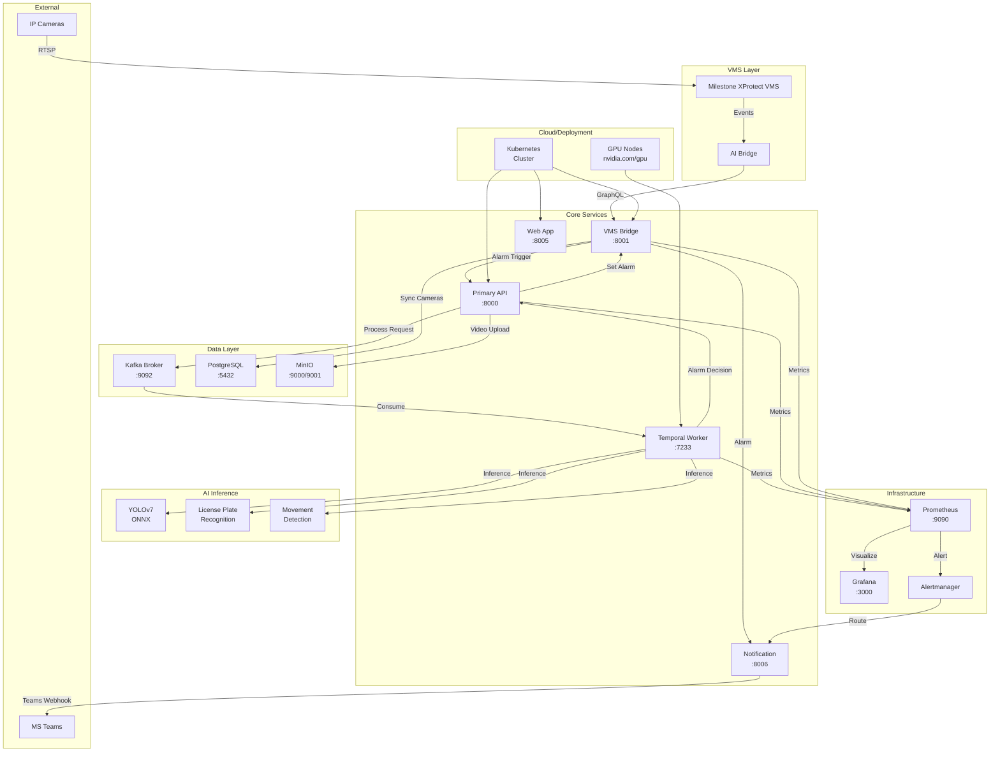
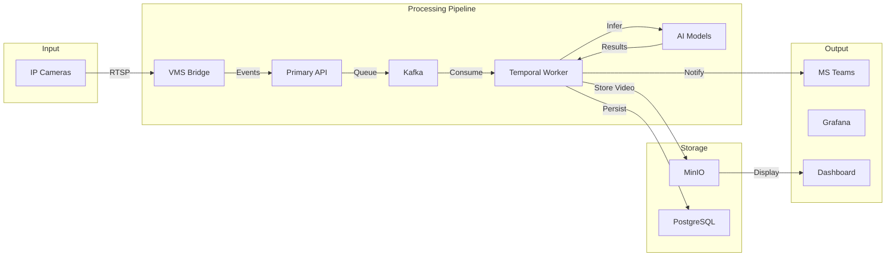
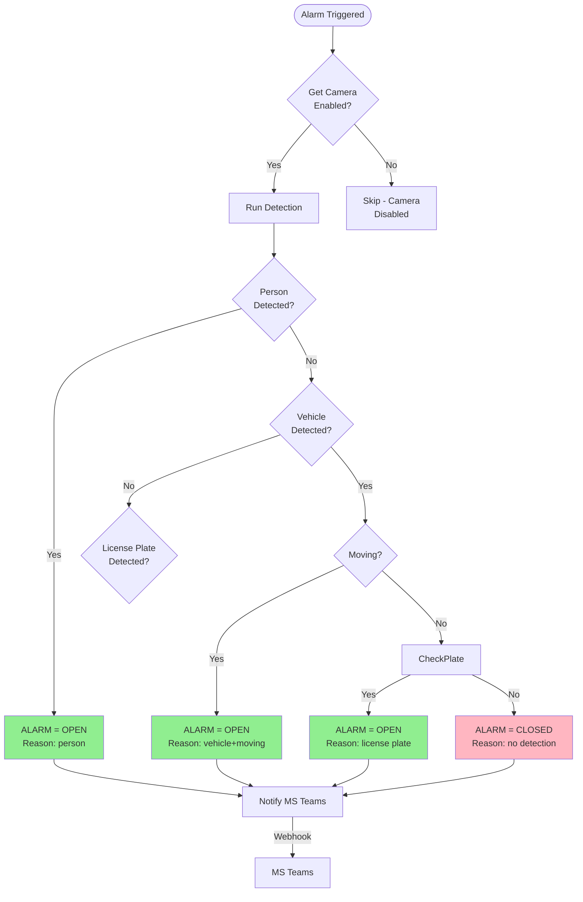
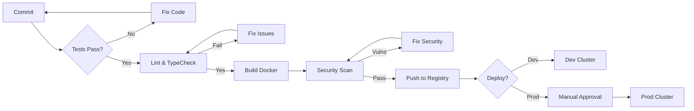
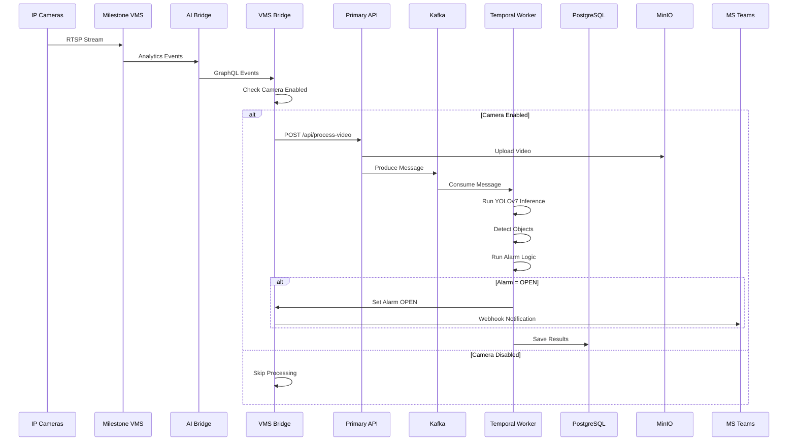

## Video AI System - Architecture Overview

## Alarm Decision Logic

## CI/CD Pipeline

## Data Flow

## Technology Stack

| Component | Technology |
|----------|------------|
| API | Express.js + TypeScript |
| Database | PostgreSQL |
| Message Queue | Kafka |
| Object Storage | MinIO |
| AI Inference | ONNX Runtime + YOLOv7 |
| Monitoring | Prometheus + Grafana |
| Deployment | Kubernetes + Helm |
| CI/CD | GitHub Actions |